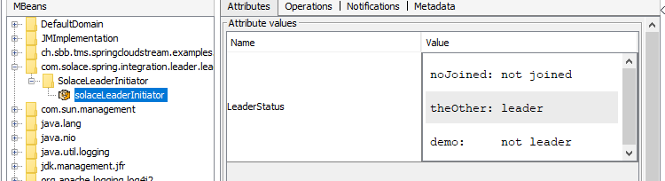
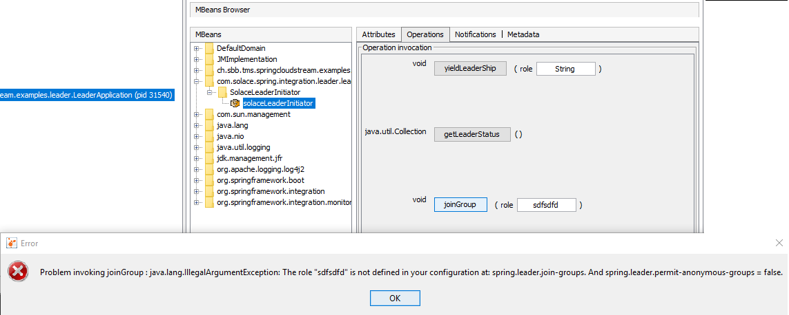

[](CODE_OF_CONDUCT.md)

# Leader election for spring integration with solace

This starter provides [leader election](https://en.wikipedia.org/wiki/Leader_election) based on solace exclusive queues.
## Spring Cloud Version Compatibility

Consult the table below to determine which version you need to use:

| Spring Cloud | solace-spring-integration-leader | Spring Boot | sol-jcsmp |
|--------------|----------------------------------|-------------|-----------|
| 2025.0.0     | 1.3.12                           | 3.5.6       | 10.28.1   |
| 2025.0.0     | 1.3.11                           | 3.5.4       | 10.25.3   |
| 2024.0.0     | 1.3.10                           | 3.4.2       | 10.25.2   |
| 2024.0.0     | 1.3.9                            | 3.4.2       | 10.25.2   |
| 2023.0.3     | 1.3.6                            | 3.3.3       | 10.24.1   |
| 2023.0.3     | 1.3.5                            | 3.3.3       | 10.24.1   |
| 2023.0.3     | 1.3.4                            | 3.3.3       | 10.24.1   |
| 2023.0.2     | 1.3.3                            | 3.3.0       | 10.24.0   |
| 2023.0.2     | 1.3.2                            | 3.3.0       | 10.23.0   |
| 2023.0.1     | 1.3.1                            | 3.2.5       | 10.23.0   |

## Usage
### Dependencies
In order to be able to use the leader election functionality, add the following section to your Maven pom:

```xml
<dependency>
    <groupId>community.solace.spring.integration</groupId>
    <artifactId>solace-spring-integration-leader</artifactId>
    <version>1.3.9</version>
</dependency>
```

## Runtime Dependencies
Starting with version 1.3.4 the JCSMP Session will be shared when provided by:
```xml
<dependency>
    <groupId>ch.sbb</groupId>
    <artifactId>spring-cloud-stream-binder-solace</artifactId>
    <version>[5.0.0,)</version>
</dependency>
```

## Use cases

### A consumer group wants to schedule tasks

Only one member of your [consumer group](https://docs.spring.io/spring-cloud-stream/docs/1.0.0.M4/reference/htmlsingle/index.html#_consumer_group_support) should run the scheduled task.

You have a service/component with the spring standard [`@Scheduled`](https://docs.spring.io/spring-framework/docs/current/javadoc-api/org/springframework/scheduling/annotation/Scheduled.html) annotation, as well as the `@LeaderAware` annotation, that suppresses the method execution if you are not leader of the example group "demo". 
```java
@Service
public class MyScheduledService {

    @Scheduled(fixedRateString = "PT3S", initialDelayString = "PT1S")
    @LeaderAware("demo")
    void scheduler() {
        log.info("I am the leader and log it schedules all 3s");
    }
}
```

The `@LeaderAware` annotation can be used on any component method. Those methods will return null if the code was not executed.
You need to specify in your application.yaml to auto join the group whenever your application is ready.
```yaml
spring:
  leader:
    join-groups:
      - groupName: demo
        joinType: ON_READINESS
```

#### Having leader group name in configuration

if your not want to have the leader group name in your configuration.
You could do:

```java
@Service
public class MyScheduledService {

    @Scheduled(fixedRateString = "PT3S", initialDelayString = "PT1S")
    @LeaderAware(configValue = "application.name")
    void scheduler() {
        log.info("I am the leader and log it schedules all 3s");
    }
}
```

```yaml

application:
  name: DemoApp

spring:
  leader:
    join-groups:
      - groupName: DemoApp
        joinType: ON_READINESS
```

### Execute business logic on leader events

When listening to leader based events, you will receive `OnGrantedEvent` and `OnRevokedEvent` events.  
You can query the leader role via `event.getRole()` or use the `condition = "#leaderEvent.role == 'demo'"` option of the `@EventListener` to receive events only for a single leader group.

This requires the `join-groups` configuration set to "ON_READINESS".

```java
    @EventListener(classes = {AbstractLeaderEvent.class}, condition = "#leaderEvent.role == 'demo'")
    void leaderEventListener(AbstractLeaderEvent leaderEvent)  {
        log.warn("LeaderController: " + leaderEvent);
    }
```

### Test for leadership within business logic

You can test whether you are the leader in your business logic and decide what you want to do with this information.
```java
@Autowired
private SolaceLeaderInitiator leaderInitiator;

private void yourLeaderMethod() {
    boolean isLeader = leaderInitiator.getContext("theNameOfTheRoleC").isLeader();
    if (isLeader) {
    	// ...
    }
    return;
}

```

### Yield the leadership - "local process (debugging)"

In case you have a cluster of leader services you may want to hand over the leadership to a local process. 
The leadership can not be taken but must be handed over to a new process, which joined the cluster. 
The order of leadership is based on the time a process joined the group. 
When a process X currently owns the leadership and wants to yield it, the next leader process will be the process, which joined the group right after process X. 

```java
@GetMapping(value = "/leader/yield/{role}")
public String yieldLeaderShip(@PathVariable("role") final String role) {
    Context context = leaderInitiator.getContext(role);
    if (context.isLeader()) {
        context.yield();
        return context.isLeader() ? "I am leader AGAIN! Am I the only group member?" : "I am not longer the leader";
    }
    return "I was not the leader";
}
```

### Yield the leadership - at shutdown

By default, the leadership will be yielded on shutdown. To improve the failover speed.
Because on a grace full application shut down. Tear down broker connection, database connection can take up to 1sec.

But if there is a reason that stops you from using this feature you can disable this by:

```yaml
spring:
  leader:
    join-groups:
      - groupName: DemoApp
        joinType: ON_READINESS
        yieldOnShutdown: false
```

or if you join groups programmatically:

```java
@Autowired
private SolaceLeaderInitiator leaderInitiator;

private void yourMethode() {
    leaderInitiator.joinGroup("theNameOfTheRoleA", false);
}
```

## Requirement

Just add this to your pom.xml file:

```xml
        <dependency>
            <groupId>community.solace.spring.integration</groupId>
            <artifactId>solace-spring-integration-leader</artifactId>
            <version>1.2.0</version>
        </dependency>
```
## Config

### join-groups

There are three different options to join a group:

* programmatically: explicitly invoke a method to join a group
* during the first request of the leader context
* as soon as your application is [ready](https://www.baeldung.com/spring-liveness-readiness-probes)

Join methods are appended to the leader group name below the "join-groups" configuration key:

```yaml
spring:
  leader:
    join-groups:
      - groupName: theNameOfTheRoleA
        joinType: PROGRAMMATIC
      - groupName: theNameOfTheRoleB
        joinType: PROGRAMMATIC
      - groupName: theNameOfTheRoleC
        joinType: FIRST_USE
      - groupName: demo
        joinType: ON_READINESS
```

### Join group PROGRAMMATIC

```java
@Autowired
private SolaceLeaderInitiator leaderInitiator;

private void yourMethode() {
    leaderInitiator.joinGroup("theNameOfTheRoleA");
}
```

By default, also those groups has to be defined in your application configuration.  
You can allow anonymous PROGRAMMATIC stated groups by setting:
```yaml
spring:
  leader:
    permit-anonymous-groups: true
```
:warning: Be aware of the side effect, to be able to join groups via JMX you may not want to be joined from this application.

### Join group FIRST_USE

The leader group will be joined when you request the leader context for the first time.

```java
@Autowired
private SolaceLeaderInitiator leaderInitiator;

@GetMapping(value = "/leader/status/{role}")
public String isLeader(@PathVariable("role") final String role) {
    return leaderInitiator.getContext(role).isLeader() ? "leader" : "passive";
}
```

### Join group ON_READINESS

The leader group will be joined as soon as your application is [ready](https://www.baeldung.com/spring-liveness-readiness-probes).
This allows to run bootstrap code like cache loading via [ApplicationRunner](https://reflectoring.io/spring-boot-execute-on-startup/)
This is useful in combination with the `@LeaderAware` annotation.

## Solace specifics

### Queues

A durable Solace queue is provisioned for each leader group. The queue name is "leader." + role. 
A queue is exclusively used for the flow activation trigger. No other messages are supposed to pass this queue.
Any other message apart from the flow activation trigger will lead to an exception.

:warning: The Solace [ClientProfile](https://docs.solace.com/Solace-Cloud/client-profiles.htm#creating-client-profiles) must have "Allow client to create endpoints" set to true

### Timeout

The fail over timeout is managed by the solace ClientProfile. (Broker version >= 9.7)

```
broker# show client smf1 detail 
Client Keepalive:
  Enabled:                    Yes
  Effective Timeout (sec):    10
broker> enable
broker# configure 
broker(configure)# client-profile default message-vpn default 
broker(configure/client-profile)# service 
broker(configure/client-profile/service)# min-keepalive-timeout 10 
broker(configure/client-profile/service)# smf 
broker(configure/client-profile/service/smf)# min-keepalive-enabled 
```

```
broker> show client-profile default message-vpn default detail 
  Client Keepalive 
    Enabled for SMF clients             : Yes 
    Minimum Timeout                     : 10    seconds 
```

## JMX integration

This starter provides some JMX operations to remote manage the application leadership.





## Micrometer integration

For monitoring purpose we provide a micrometer metrics.

Here an example if your application uses the micrometer-prometheus-registry. 
```
# HELP leader_status Indicates if this project is [-1=not joined, 0=joined but not leader, 1=is leader] for a group.
# TYPE leader_status gauge
leader_status{group="noJoined",} -1.0
leader_status{group="theOther",} 0.0
leader_status{group="demo",} 1.0 
```

## Resources

For more information try these resources:

- The Solace Developer Portal website at: https://solace.dev
- Ask the [Solace Community](https://solace.community)

## Contributing

Please read [CONTRIBUTING.md](CONTRIBUTING.md) for details on our code of conduct, and the process for submitting pull requests to us.

## Authors

See the list of [contributors](https://github.com/solacecommunity/spring-solace-leader-election/graphs/contributors) who participated in this project.

## License

See the [LICENSE](LICENSE) file for details.
